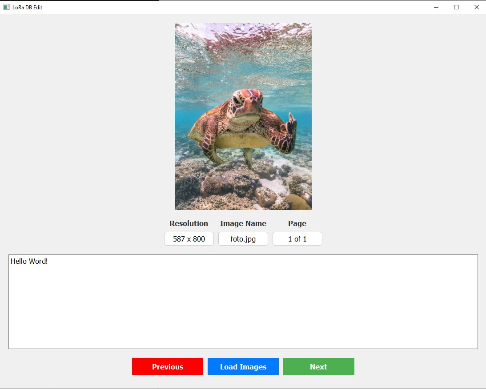

## LoRaDBEdit

### Description
LoRaDBEdit is a program designed to verify and correct text files already associated with images in a LoRa database. This tool allows users to easily view the text files linked to each image, correct any errors, add new information, or remove unnecessary files.




### Features
- **Verification of associated text files**: Examines the text files already associated with images in the database to ensure they are correct and up-to-date.
- **Correction of text files**: Allows users to modify existing text files to fix errors or add new details.
- **Removal of unnecessary text files**: If a text file is obsolete or no longer needed, it can be easily removed.
- **Image navigation**: Browse through the images in the database and view the associated text file to verify its contents.
- **Metadata updates**: Changes made to the text files are automatically saved without the need for a "Save" button.
- **Matching file names**: The image files and text files must have the same name (e.g., `image1.jpg` and `image1.txt`) in order for the program to correctly associate the files and for the LoRa database to function as intended.

### How to use
1. **Load the database**: Click on "Load Images" to load the folder containing the images and their associated text files.
2. **Navigate through the images**: Use the "Previous" and "Next" buttons to scroll through the images and view their respective text files.
3. **Verify and correct the text**: If a text file contains errors or outdated information, you can easily correct it.
4. **Remove unnecessary text**: If a text file is no longer needed, you can remove it with a single click.
5. **Automatic saving**: Changes to the text files are automatically saved without requiring confirmation.

### Requirements
- Python 3.x
- PyQt5
- Pillow (for image handling)

### Installation
1. **Clone the repository**:
    ```bash
    git clone https://github.com/mercu-lore/LoRaDBEdit.git
    ```
2. **Install dependencies**:
    ```bash
    pip install -r requirements.txt
    ```
3. **Run the program**:
    ```bash
    python LoRaDBEdit.py
    ```

### License
This project is licensed under the MIT License.
